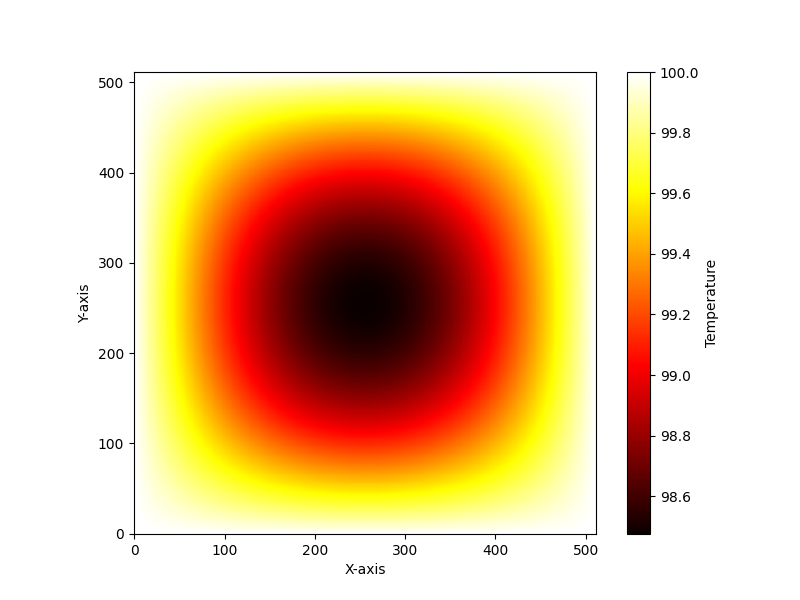

# GPU-Laplacian-Solver
> **Note**: This project is still a **work in progress**. 

**GPU-Laplacian-Solver** is a C++/CUDA project that implements the **Successive Over-Relaxation (SOR)** and **Red-Black SOR** methods to solve **Laplace’s equation** in two dimensions. It provides both CPU and GPU implementations, can validate results against an analytical solution, and includes Python-based plotting tools.

## Table of Contents

- [Features](#features)
- [Installation](#installation)
- [Usage](#usage)
  - [Building Both CPU and GPU](#building-both-cpu-and-gpu)
- [Example Solutions](#example-solutions)
- [Future Work and Optimization Roadmap](#future-work-and-optimization-roadmap)
- [Boundary Condition Implementation Status](#boundary-condition-implementation-status)

---

## Features

- **CPU Implementation**  
  - \[`cpu/`\]: Implements SOR and Red-Black SOR on the CPU.  

- **GPU Implementation**  
  - \[`cuda/`\]: Implements CUDA-based solvers, including basic SOR kernels, and shared-memory optimizations.

- **Analytical Solution**  
  - Provides a Fourier-based solution for Laplace’s equation for validation.

- **Plotting**  
  - Python script (\[`scripts/plot_solution.py`\]) to visualize the 2D solution as a heatmap or surface plot.

- **Testing**  
  - Contains basic test setups (especially in the GPU subfolder) to validate solver correctness.

---


## Features

- **CPU Implementation**: The `cpu/` directory contains the CPU version of the SOR and Red-Black SOR methods.
- **GPU Implementation**: The `cuda/` directory contains the GPU-accelerated versions using CUDA.
- **Analytical Solution**: Provides analytical solutions for validation purposes.
- **Plotting**: Includes Python scripts for visualizing the results.
- **Testing**: Contains test suites to validate the correctness of the implementations.

## Installation

### Prerequisites

- **C++ Compiler**: Required for compiling the CPU version (e.g., `g++` or `clang++`).
- **CUDA Toolkit**: Required for compiling the GPU version.
- **CMake**: For build configuration (version 3.20 or higher recommended).
- **Python 3**: For running plotting script.

### Steps

1. **Clone the repository**

   ```bash
   git clone https://github.com/joehrz/GPU-Laplacian-Solver.git
   cd PDE-GPU-Solver

2. **Building**

   ```bash
   mkdir build
   cd build
   cmake .. -DBUILD_CPU=ON -DBUILD_CUDA=ON
   cmake --build . --config Release

## 6. Example Solutions

<div align="center">

| Basic CUDA Implementation | Shared Memory |
|:-------------------------:|:-----------------------:|
|  |  |


</div>

## Future Work and Optimization Roadmap

### Short-Term Goals

**1. Advanced GPU Optimizations**  
- **Kernel Fusion with Wavefront Pattern**: Combine memory operations with computation to reduce global memory access  
- **Adaptive SOR (ASOR)**: Implement dynamic relaxation factor adjustment for faster convergence  
- **Mixed Precision Computing**: Use FP16 storage with FP32 calculations for memory bandwidth optimization  

**2. Boundary Condition Enhancements**  
- **Cylindrical Coordinate Support**: Full implementation of axisymmetric Neumann conditions  
- **Composite BC Handling**: Unified interface for mixed Dirichlet/Neumann boundaries  
- **Adaptive Meshing**: Variable grid spacing near boundary layers  

### Long-Term Goals

**1. Advanced Physics Capabilities**  
- **Non-Linear Extensions**: Support for Poisson-Boltzmann equation  
- **Time-Dependent Solutions**: Transient heat equation integration  
- **Multi-Physics Coupling**: Electromagnetic + thermal simulations  


---

## Boundary Condition Implementation Status

The solver currently supports basic Dirichlet/Neumann conditions. Future work will implement:

| Boundary | Region                  | Type       | Physical Description                   |
|----------|-------------------------|------------|----------------------------------------|
| 1        | Top Surface             | Neumann    | Zero vertical flux boundary            |
| 2        | Outer Radial Wall       | Neumann    | Insulating radial boundary             |
| 3        | Central Axis            | Neumann    | Axisymmetric symmetry condition        |
| 4        | Magnetic Interface      | Neumann    | Controlled vertical flux injection     |
| 5        | Inner Cylinder Wall     | Neumann    | Contained radial boundary              |
| 6        | Base Plate              | Dirichlet  | Grounded electrical potential          |

Full cylindrical coordinate support with adaptive BC handling
